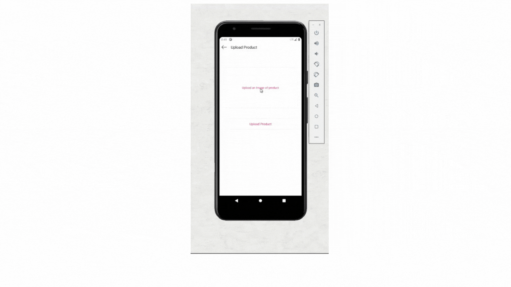

# StyleWise

StyleWise is an innovative application that recommends clothing based on scanning or uploading an image. It utilizes a Convolutional Neural Network (CNN) based recommender system to provide personalized fashion suggestions.

## Demo



## Features

- Image-based clothing recommendation
- Support for both image scanning and uploading
- Powered by a CNN-based recommender system
- User-friendly interface for easy interaction

## Project Structure

The project consists of three main components:

1. Mobile App (React Native)
2. Server
3. Web Application

## Prerequisites

Before you begin, ensure you have the following installed:
- Node.js and npm
- Yarn
- React Native development environment
- Python (for the CNN model)

## Installation and Setup

### 1. Mobile App (React Native)

```bash
cd client
yarn install
yarn android  # For Android
# or
yarn ios      # For iOS
```

### 2. Server

```bash
cd server
npm install
npm run dev
```

### 3. Web Application

```bash
cd WebApp/myapp
yarn install
yarn start
```

## Database Setup

The database images should be populated in the following directory:

```
WebApp/myapp/public/images/
```


